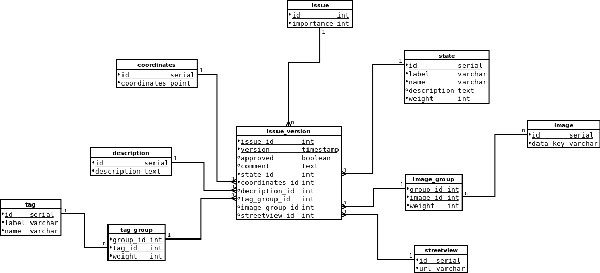

# Roadwork API

A Flask based REST API that can be used to track issues along the road.

## Development

### Setup

See: [Local development](documentation/local_development.md)

### Database structure

